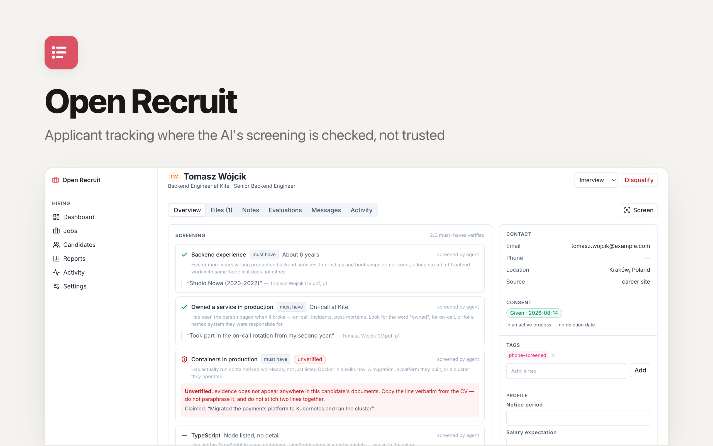

<p align="center">
  <picture>
    <source media="(prefers-color-scheme: dark)" srcset="./readme-banner-dark.png">
    
  </picture>
</p>

# Open Recruit

Applicant tracking with your own careers site — where the AI's screening is **checked, not trusted**.

Post a job, take applications, run a hiring pipeline, and let your AI agent read every CV against the requirements you wrote. Each thing it marks as *met* has to carry a quote from the candidate's own CV, and the app finds that quote in the document before it will count it. One it cannot find is shown as **unverified** and counts for nothing.

An open-source app template provided by [Clawnify.com](https://clawnify.com). An alternative to Workable, Greenhouse, Teamtailor and Lever.

## Why this exists

Every ATS now puts a match score on the candidate card. Ask a capable model to screen forty CVs against a job spec and most of what comes back is right — the problem is the rest: a confident *"8 years of Kubernetes in production"* about someone whose CV says nothing of the kind.

In most software a hallucination is an annoyance. Here it decides whether a person gets an interview, and it survives review, because nobody re-reads the requirement that already has a tick next to it.

So Open Recruit doesn't ask for a match score. It asks for evidence, and checks it:

```
verdict + quote  →  is that line really in this candidate's CV?
                      ├── yes → counts, with the quote and page shown
                      └── no  → stored as unverified, shown as unverified,
                                and excluded from the score
```

The check is mechanical — a normalised match against the text extracted from the file the candidate actually sent — so it holds whichever model, prompt or version produced the answer. It tolerates what legitimately differs (smart quotes, ligatures, the spurious spaces a two-column CV export produces, a line running over a page break) and nothing that changes meaning: *5 years* never matches *8 years*.

The number on the card is therefore a count of verified facts, not a model's confidence in itself.

## What it does

**Jobs and the pipeline**
- A job with its own kanban pipeline — fixed *sourced* / *applied* / *hired* stages and as many of your own between them as you like. Save a pipeline you like and start the next job from it.
- A **stage limit** flags anyone who has been sitting in one place too long. Candidates are rarely rejected; they are forgotten.
- Disqualify with a reason, from a list you can extend — and the pattern of reasons across a job turns out to be the most useful thing in the reports.
- Bulk move, bulk tag, bulk disqualify — still one log entry per person, because a bulk rejection is fifty individual decisions.

**Your careers site, and getting seen**
- A public, branded careers site at `/careers` with a page per job, your logo and your colour.
- Every published job carries valid **`JobPosting` structured data**, so it is eligible for job search results with no ad budget and no board contract.
- A **job feed** at `/jobs.xml` for any board that accepts a feed URL, and a one-line **`<script>` widget** that drops your openings onto your own marketing site with no build step.
- Application form with your own questions. A **knockout answer flags** the application for a human — it never rejects anybody (see below).

**Candidates**
- A candidate is a person, not an application. Someone who applies to three roles is one record, which is what lets the app answer *"have we spoken to this person before?"*
- CV and cover letter text extracted on upload (PDF, Word, plain text) — that text is what evidence is checked against.
- Talent pools, tags, and custom profile fields your team defines.

**Deciding, together**
- Structured evaluations on a four-point scale with no middle, so an answer is a recommendation rather than a shrug.
- Notes (team or private), tasks, and scheduled interviews.
- Message templates, and correspondence recorded against the candidate whether or not you have a mail provider connected.

**Reports** — where candidates come from and which sources actually convert, how far people get, why they're turned down, time to hire.

## Two things it deliberately will not do

**It will not let the AI decide.** The agent screens and recommends. Moving someone forward, rejecting them, hiring them and writing to them are refused at the API for an agent caller — not discouraged in a prompt, refused. Every decision is recorded against a named person with a timestamp and a reason.

**It will not auto-reject on a knockout answer.** Recruiting software normally does. But *"do you have the right to work here?"* is answered "no" by people three weeks from a permit, and a rejection sent by a machine to that person is both a worse hire and precisely the kind of decision someone is entitled to have a human make. So a mismatch surfaces at the top of the pipeline and costs a person four seconds.

Both matter beyond taste. AI used for *"the recruitment or selection of natural persons, in particular… to analyse and filter job applications, and to evaluate candidates"* is classified as high-risk under Annex III of the EU AI Act (Regulation 2024/1689), and GDPR Article 22 gives a person the right not to be subject to a decision *"based solely on automated processing"* that significantly affects them. A verifiable evidence trail and a named human on every decision are what those obligations look like in a database.

## Fairer by default

Two settings, both cheap, both on the Hiring page:

- **Hide names in the early stages.** Bias in hiring is mostly not a decision anyone makes; it is a reaction to a name at the top of a CV, before the reading starts. Identity is withheld until a candidate reaches the stage you choose.
- **Hide colleagues' evaluations until you submit yours.** The first opinion in the room otherwise becomes everybody's, and four agreeing scorecards then read as four independent judgements.

## Consent and retention

Applications record the consent notice **as it was worded when they agreed**, so a later edit does not rewrite anyone's consent. The retention clock starts when a person's last application closes — nobody in an active process has a deletion date — and the Data page lists who is past their period and erases them, files included, on a deliberate click rather than a silent 3am job.

## How it works

| | |
|---|---|
| **The app** | holds the jobs, the pipeline and the record; extracts the text of every CV; verifies every piece of evidence; keeps the audit trail |
| **Your agent** | reads the CVs and fills in the requirements grid, with evidence |
| **You** | decide |

There is no chat window and no model provider key, on purpose — your Clawnify agent already is the reader, reachable from the dashboard, WhatsApp or email. Press **Screen applicants** and the work is handed to it; if it can't be reached you get the brief to paste into a chat instead.

## Local development

Requires Node 22+ and pnpm.

```bash
pnpm install
pnpm dev          # UI on :5173, API on :8790
pnpm seed         # a company, two roles, six candidates part-way through
```

```bash
pnpm test         # the verification rules
pnpm typecheck
pnpm build
```

The seed data is built so the check is visible: one candidate's screening carries a claim whose quote is genuinely absent from his CV, and it renders as unverified.

Off-platform there is no agent to dispatch to — **Screen applicants** hands you the brief to copy instead. Sending candidate email needs a `RESEND_API_KEY` and `HIRING_FROM_EMAIL`; without them messages are composed, recorded and handed to you to send.

## Deploy

```bash
npx clawnify deploy
```

Or use the button in the [Clawnify app directory](https://app.clawnify.com). Each deployment gets its own database and file storage — the applications stay inside your own organisation.

## Extending it

- **The verification rule** lives in one file, `src/server/evidence.ts`, with its tests beside it. Read that first, and be careful with it.
- **More question types** — `screening_criteria.type` already carries `boolean | years | text | enum`.
- **Calendar and mail sync** — interviews are recorded locally today; a provider integration slots in beside `interviews` rather than replacing it.
- **Deliberately absent:** a job-board reselling layer. We can't resell board credits honestly, so the app ships the free distribution path instead — structured data, a feed, and a widget.

## Licence

MIT. See [LICENSE](LICENSE).
